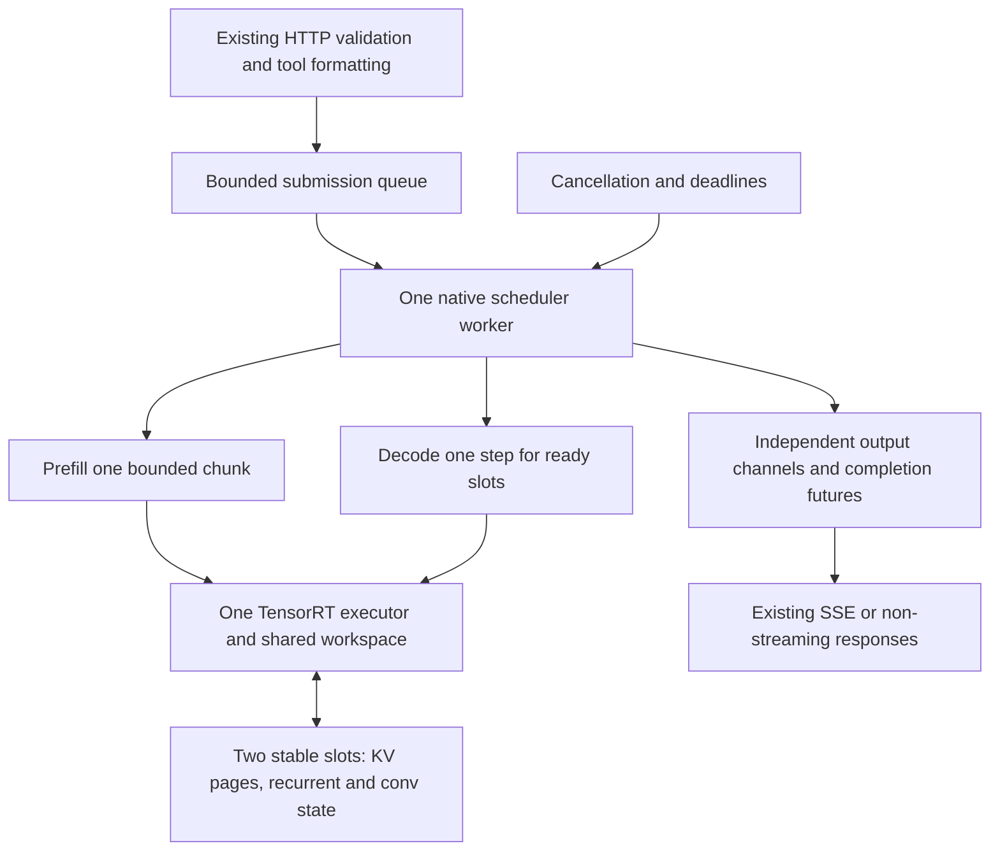

# Continuous batching and chunked prefill for the Jetson

Design proposal, 2026-09-12. Research and source inspection only; implementation and deployment have not started.

## 1. Intended outcome

Extend the existing TensorRT Edge-LLM server so a newly arriving text request can enter a free sequence slot while another request is generating. Process long prompts in bounded chunks, service existing decodes between chunks, and decode ready sequences together. Complete and release each request independently; immediately reuse a freed slot while its partner continues.

This plan supersedes the earlier recommendation to start with Python request coalescing. Coalescing is not the requested deliverable. The endpoint remains OpenAI-compatible, streaming and non-streaming, using model alias `openclaw` and one resident model/runtime.

Initial production target: Qwen3.5-4B INT4 AWQ, text-only vanilla decoding, single GPU/rank, maximum two resident sequences including partially prefilled requests. Keep the existing 6,144-token prompt / 8,192-token total sequence limits. Context reuse and speculative decoding are disabled in the recorded deployment and are outside this first implementation. Different supported sampling settings, output budgets, stop strings, tool prompts and streaming modes must work concurrently; identical generation parameters will not be required.

## 2. Research and what it changes in this design

Web research used primary papers and official project documentation, checked 2026-09-12. These establish design principles, not performance predictions for an Orin.

| Source | Relevant finding | Application here |
| --- | --- | --- |
| [Orca, OSDI 2022](https://www.usenix.org/conference/osdi22/presentation/yu) | Scheduling at iteration boundaries permits batch membership to change during generation. | The native worker owns a persistent set of sequences and schedules bounded steps instead of whole completions. |
| [Sarathi-Serve, OSDI 2024](https://www.usenix.org/conference/osdi24/presentation/agrawal) | Chunking prompt work makes it possible to admit prompts with less disruption to ongoing decodes; its implementation mixes prefill and decode work. | Borrow bounded prompt work and decode progress guarantees. Do not claim its mixed-execution efficiency or benchmark gains for our separate-profile engine. |
| [vLLM optimization documentation](https://docs.vllm.ai/en/latest/configuration/optimization/#chunked-prefill) | Decode-first scheduling spends the remaining token budget on prompt chunks; chunk size trades first-token latency against token-stream latency. | Begin with a fixed chunk cap, then tune against measured step duration on the Jetson. Include fairness so a prefill keeps progressing. |
| [NVIDIA TensorRT-LLM scheduling documentation](https://nvidia.github.io/TensorRT-LLM/features/paged-attention-ifb-scheduler.html) | Packed inputs and paged cache support efficient mixed-phase execution; chunked context has backend-specific block-alignment requirements. | Audit Edge-LLM's engine contract directly. TensorRT-LLM is a different runtime, so its flags and alignment rules are not automatically available here. |
| [vLLM hybrid cache design](https://docs.vllm.ai/en/latest/design/hybrid_kv_cache_manager/) | Hybrid architectures require distinct handling of attention storage and recurrent state. | Preserve both kinds of state for Qwen3.5, including convolution history; attention pages alone are insufficient. |
| [NVIDIA PR #199](https://github.com/NVIDIA/TensorRT-Edge-LLM/pull/199) | Coalesces compatible non-streaming requests into whole native batches; continuous admission and streaming batching remain absent. | Use as reference for server integration and tests. Do not depend on or merge its unrelated builder fixes to implement this scheduler. |

The Sarathi PDF endpoint failed during this research; the official conference page and [arXiv abstract](https://arxiv.org/abs/2403.02310) were available. No claim here depends on inspecting an unavailable figure or reproducing those papers' experiments.

## 3. Verified source foundation and remaining uncertainty

Source checkout: `/Users/ajmalrasi/openclaw-tensorrt-concurrency-review`, pinned to `e8b29522938901f6df19ebeedd4b69bc8edbcd97`. No source modifications. Existing-engine loading edits on the Jetson are separately recorded and must be preserved when implementation begins.

New evidence makes a native implementation more plausible:

- `cpp/runtime/llmRankRuntime.cpp`, `runBaseModelPrefill`: supports `sampleOutput=false` and commits prefill lengths before returning. The MTP endpoint-reuse path already invokes multiple base prefills with sampling deferred. That is useful precedent, not proof of vanilla interleaving correctness.
- `cpp/runtime/exec/registryBuilder.cpp:143` and `cpp/builder/llmBuilder.cpp:787`: describe/allow initial-prefill empty start-index tensors and resumed-prefill start offsets. Attention KV storage is a fixed pool with a dynamic per-execution page-table row count.
- `cpp/plugins/gatedDeltaNet/gatedDeltaNetPlugin.h:53`: recurrent state enters and exits as batch-dense tensors. Its implementation consumes existing state, so chunk continuation has a concrete interface to test.
- `cpp/plugins/mamba/causalConv1dPlugin.cpp`: prefill consumes an initial convolution state, and a separate single-token path updates that state. Tail lengths of one and lengths around the convolution boundary require explicit tests.
- `cpp/common/tensor.h:279`: non-owning tensor views can address a row inside an existing allocation.
- `cpp/runtime/exec/engineExecutor.cpp:122`: graph caching already hashes binding addresses and shapes and validates the binding snapshot. Stable slot views can use this mechanism, subject to profile-switch validation.

The blocking assumptions are in orchestration: `HybridCacheManager` treats active rows as a contiguous prefix, has a global empty-cache flag, and commits lengths for all active rows; `StepPreparer` reads that shared prefix. `handleRequest` owns a local whole-request context; the coordinator dispatches whole requests; output and sampling policies are largely batch-wide. Those interfaces must change together.

Engine reuse remains a hypothesis until the first native proof passes. Source-level support for resumed offsets does not establish that the actual serialized engine, its plugins, and every relevant shape are correct on SM87.

## 4. Execution architecture

There is one native execution owner and one primary CUDA stream. TensorRT may retain its existing internally managed auxiliary streams, but HTTP callers cannot launch independent engine work. This avoids reentrancy and duplicated model memory.

The first implementation uses separate executions of the existing prefill and decode profiles. For example: decode A, prefill a chunk of B, decode A, prefill the next chunk of B, then decode A+B. This is real continuous admission plus chunked prefill. It does not combine a prompt chunk and a decode row into one packed engine execution, and therefore may pay extra weight reads and profile-switch overhead. Measure that cost explicitly.

Mixed-phase packed execution is a later optimization if these costs prevent the required latency/throughput. It could require exporter/plugin changes and a separate engine build; it is not assumed necessary for functional continuous scheduling, and not promised to fit the present artifact without modification.

### Per-request state

Create a native `SequenceState` with a stable request ID and generation-tagged slot handle. Proposed fields:

- Immutable formatted/tokenized prompt, original prompt-token count and request-specific parsing metadata.
- Lifecycle: queued, prefilling, decoding, finished, cancelled or failed.
- Physical slot ID, prompt cursor, committed sequence length, pending next input token and generated-token count.
- Per-request output limit, sampling parameters, random seed/counter, stop matching, thinking state and logprob policy.
- Cancellation flag, queue deadline, optional generation deadline, output channel and completion promise.
- Timing counters for queue wait, CPU preparation, prompt chunks, first token and decode steps.

The slot generation tag prevents a late cancellation for A from cancelling C after C reuses A's physical slot. Only the scheduler may transition lifecycle state or recycle GPU storage. Public cancellation enqueues a command or sets a thread-safe flag; it never resets GPU memory from an HTTP thread.

### Native and Python boundary

Add submission, cancellation, status and shutdown operations around the single-rank coordinator. Names such as `submit`, `cancel`, `wait_result` and `close` are proposed interfaces, not existing APIs. A submission returns a ticket/channel promptly; waiting releases the GIL. Stream consumers do not call `handleRequest` and do not own/join the shared scheduler worker.

Factor reusable request formatting/tokenization out of `prepareRequestState`. Keep preparation bounded and avoid concurrent access to mutable tokenizer/formatter state. During initial correctness work the owner can serialize preparation at scheduling boundaries and measure its latency. Move it to one bounded preprocessing worker only after tokenizer ownership/thread safety and the CPU-memory cost are established; never duplicate GPU runtime state for preprocessing.

Keep the synchronous whole-request API for compatibility using common execution primitives. Scheduler-enabled execution and the legacy path cannot touch the same runtime concurrently. Unsupported models/modes fail explicit scheduler capability validation; the current text endpoint keeps its supported tool/reasoning protocol.

## 5. Stable GPU slots and memory

Use physical slots 0 and 1 for the life of the runtime, with request ownership changing only at safe boundaries. Initially reserve each slot's entire sequence capacity from the already allocated KV pool. At 128 tokens per page and 8192 capacity this is 64 pages per slot, using the recorded 128-page pool. Verify that page constant and the loaded profile before execution.

This fixed reservation is intentional for a batch-two edge deployment: no per-token GPU allocation, no swapping/recomputation to admit a third resident sequence, and no need for prefix-cache records or recurrent snapshots. A larger request queue contains CPU metadata only and has a byte cap as well as a request-count cap.

Build persistent execution views for slot 0 alone, slot 1 alone and both slots in physical order. Each view binds:

- The full existing attention KV pool, with page-table rows for exactly the selected slots.
- Non-owning views of the selected recurrent and convolution rows, including matching output bindings.
- Selected sequence-length/start-offset metadata, RoPE lookup bindings and shared transient input/logit buffers.

For two slots these subsets are contiguous, so no recurrent gather/scatter is required in the proposed normal path. Do not compact a still-live request from slot 1 to slot 0 just because slot 0 finished. Do not use a dummy decode token or zero-length padded request to keep a hole occupied.

Add slot-aware reset and commit operations. Reset only the newly allocated slot, commit lengths only for rows actually executed, and compute initial/resumed-prefill status from the selected request. The current global `mKVCacheAllEmpty` and contiguous-prefix updates cannot be used unchanged.

Raw model-state estimate from the previously inspected config, excluding all workspace, weights, activations, graphs and allocator overhead:

| Existing two-slot state | Calculation | Size |
| --- | --- | --- |
| Attention KV | 2 slots × 8192 positions × 8 layers × K/V × 4 heads × 256 dimensions × 2 bytes | 512 MiB |
| Recurrent state | 2 × 24 layers × 32 heads × 128 × 128 × 4 bytes | 96 MiB |
| Convolution state | 2 × 24 layers × 8192 channels × 4 history positions × 2 bytes | 3 MiB |

These approximately 611 MiB are modeled existing allocations, not a proposed additional allocation or a measured total. The design goal is to reuse them. The last system snapshot had only 332 MiB available RAM; it was not refreshed for this planning turn. Establish the actual allocation budget before enabling a candidate. Bound output buffering, preparation, logprobs, graph count and diagnostic traces. Smaller chunks do not automatically reduce workspace already reserved by a large serialized engine.

## 6. Chunk semantics and scheduling policy

Tokenize the full formatted prompt exactly once. Chunk token IDs rather than independently applying the chat template to each fragment.

For every non-final chunk: consume the true prompt tokens, continue attention KV and GDN/convolution state from the preceding chunk, commit the cursor and sequence length, and do not sample or emit a completion token. After the final chunk, sample the first output token exactly once. Decode consumes the pending sampled token, advances cached length, and samples its successor.

Maintain an explicit distinction between tokens already represented in model state and the most recently sampled token waiting to be consumed. After a completed prefill and N emitted output tokens, the normal vanilla cache length is prompt length + N − 1. Use that invariant to prevent duplicate/skipped boundary tokens and off-by-one output accounting.

Initially restrict chunk candidates to shapes verified by the engine/plugin proof. A starting experiment set is 64, 128 and 256 tokens; 128 is a provisional default only. Exercise arbitrary final remainders, including one token. Do not transfer TensorRT-LLM's page alignment requirement without checking Edge-LLM's kernels. If minimum/aligned shapes require tail adjustment, use a verified tail partition or dedicated continuation step, never silently add real tokens or assume padding leaves recurrent state unchanged.

Each scheduler cycle:

1. Observe completions/cancellations; finish output promises and release slots whose last CUDA work is complete.
2. Admit the oldest valid pending requests into free resident slots without waiting to form a batch. At most two requests are resident, including prefills.
3. Decode one step for every ready sequence, batched together even when their sampling settings differ.
4. If a resident prefill exists, process at most one bounded prompt chunk, then return to decode scheduling. With two prefills and no decodes, alternate chunks fairly; larger chunks may be used when there is no stream to interrupt, after measuring the effect on newly arriving requests.
5. Sleep on a condition variable only when no runnable work or command exists. No busy polling.

A cancelled prefill stops at the next chunk boundary; CUDA kernels are not assumed preemptible. The prefill slot cannot be reused while its chunk is still executing. Once B's prefill completes, it joins the next decode step; C cannot be admitted while both A and B still own resident slots.

Start with a fixed cap and trace actual chunk durations. Then add a bounded controller selecting among verified chunk sizes from recent duration estimates, with conservative reduction and slow growth. Include profile-switch, sampling, CPU preparation and state-binding overhead in the observed inter-token gap. An initial 200 ms token-gap target under one long arriving prompt is a tuning hypothesis, not a hard real-time guarantee. If no supported chunk meets it, record the achievable frontier rather than silently starving B.

FIFO admission plus guaranteed progress for each resident prefill avoids starvation. Keep the existing 16-request queue / 120-second queue timeout as initial service defaults, subject to an additional bounded payload/token-storage budget. Queue waiting, prefill work and active generation are separate metrics and timeout concepts.

## 7. Independent sampling, streaming and failures

Run the model forward for all ready slots together, then apply sampling to each logit row with its own settings. With batch two, separate sampler calls over non-owning row views are a reasonable first implementation and preserve concurrent model execution. Vectorize later only if profiling warrants it. Use request-owned RNG seed/counter state; the existing sampler accepts explicit Philox seed/offset, so random draws need not depend on physical batch position. Do not promise identical stochastic output to the legacy path if its RNG behavior differs.

Enforce independent output and KV headroom limits. Remove the continuous path's dependence on a batch-wide minimum output clamp: one long prompt must not shorten another user's response. Thinking/EOS handling, stop strings, logit bias, logprob count and finish reason also belong to the sequence. Preserve model-wide incompatibility checks such as unsupported adapters or speculative modes.

Both HTTP streaming modes share this scheduler. Streaming consumes per-request events; non-streaming accumulates the same request's output and resolves as soon as that request finishes, without waiting for its partner. Preserve UTF-8 handling, tool parsing and OpenAI usage/terminal events.

Bound output queues. A slow/disconnected reader cannot block the native worker and stall the other request. On a full per-request buffer, apply a documented cancellation/timeout policy, retain the terminal result separately, and reclaim its slot at the next safe boundary. Test this rather than assuming existing channel buffering is bounded.

Invalid input fails only that request before admission. A CUDA/TensorRT error that may invalidate shared state fails the active requests and marks the runtime unready; do not continue with possibly corrupted state or replay partially emitted responses automatically. Reuse the service's bounded restart policy. Shutdown rejects new work, drains or cancels with a deadline, and joins the worker before destroying CUDA resources.

## 8. Code change map

Paths are relative to the pinned source checkout. New names are design proposals.

| Area | Existing code to adapt / proposed addition |
| --- | --- |
| Native lifecycle | `cpp/runtime/llmRankRuntime.{h,cpp}`: factor prepare, prefill-chunk, forward-decode, per-request completion out of whole-request execution. |
| Scheduler | Add `cpp/runtime/scheduling/` containing sequence state, queue/slot ownership, step planner and one worker; keep these policies separate from kernels. |
| Public runtime/coordinator | `cpp/runtime/llmInferenceRuntime.{h,cpp}`, `cpp/runtime/multiDevice/runtimeCoordinator.{h,cpp}`: single-rank submission/ticket lifecycle; preserve legacy and multi-rank behavior outside the new mode. |
| State/metadata | `hybridCacheManager`, `mambaCacheManager`, `state/kvPageTable`, `state/sharedResources`: slot-selective initialization, execution views and commits. |
| Step execution | `preprocess/stepPreparer`, `exec/tensorMap`, `exec/registryBuilder`, `decoding/vanillaDecoder`: accept explicit selected rows and separate forward execution from sampling. |
| Python binding | `experimental/pybind/edgellm_pybind.cpp`: submit/cancel/result/status, GIL-free waits and lifetime guarantees. |
| HTTP integration | `experimental/server/runtime/engine.py`, `engine_client.py`, config and health routes: bounded admission and independent streams/futures. Preserve deployed `--engine-dir` support. |
| Tests and operator material | Native unit tests, existing server test suite, a bounded staggered-arrival harness, journal and deployment instructions. |

Audit TensorRT graph behavior before optimization. Initially validate with eager execution. Later capture only the finite decode views `{0}`, `{1}`, `{0,1}` using stable buffers; confirm profile identity and all aliased bindings participate in safe lookup. Never recapture per request or per prompt length. Capture warmups mutate state, so perform them before requests or reset all affected slots before admission. Do not claim lower single-user overhead until graphs and eager fallback are both tested.

## 9. Implementation milestones and exit criteria

Each milestone is a reviewable change with evidence. This is one continuous-batching implementation delivered in stages, not a substitute coalescing solution.

| Milestone | Work | Required evidence before proceeding |
| --- | --- | --- |
| 1. Engine/state proof | Small native harness against the existing engine: resumed chunks, alternate physical slots, selected-row commits, prefill/decode profile switching. | A's inactive state is unchanged while B prefills; chunked B matches the established full-prefill reference within a predefined numerical policy; final-token tails work; no unexpected state-sized allocation. |
| 2. Native step interfaces | Persistent `SequenceState`, fixed slot views, explicit prepared token IDs, independent limits/sampling, preserve legacy whole-request path. | One-request regression checks; slot 1 alone works; request lifecycle invariants and sampled-versus-committed token counts hold. |
| 3. Continuous worker | Bounded queue, decode-first step planner, chunk progress, immediate slot reuse, cancellation/deadlines and fault propagation. | Native A-start/B-arrives/C-reuses trace proves progress before the previous group finishes; no state contamination or starvation. |
| 4. HTTP integration | Submit/tickets and per-request SSE/results, per-client parsing/usage, queue accounting, slow consumers and shutdown. | Two staggered streaming clients overlap; mixed streaming/non-streaming and differing parameters work; disconnected A does not terminate B. |
| 5. Performance and memory | Finite CUDA graphs, chunk-size selection, bounded buffers, progress metrics, operator diagnostics. | Stable memory and graph counts, measured token-gap/TTFT/throughput tradeoff, singleton regression characterized. |
| 6. Production handoff | Candidate installation, smoke checks, recovery/watchdog compatibility, rollback documentation. | All correctness gates pass; controlled current-engine endpoint comparison; exact artifact/config recorded with recoverable previous runtime. |

If milestone 1 fails because of a serialized profile or plugin limitation, isolate whether it is a binding bug, kernel continuation bug or genuine engine-contract restriction. Fix native binding/kernel code where sufficient. If an engine change is required, specify the exact contract change and preserve the working artifact; do not repeatedly rebuild/export in hope. Runtime-only work uses existing ONNX/engine artifacts. A model graph/export change requires its own export → build → inference verification.

## 10. Test matrix and acceptance

Correctness precedes throughput. Use synthetic/non-private prompts and reference outputs, never log real email contents.

- Chunk continuation at 1, 3, 4, 63, 64, 65, 127, 128, 129 and chunk boundaries, with long prompts up to 6144; compare full-prefill and chunk-prefill state/logits and teacher-forced continuations.
- Exact inactive-slot state checks during another slot's execution; A then B and B then A; slot 1 as the only active row; repeated free/reuse cycles and stale cancellation tickets.
- Two different output limits, prompt lengths, temperatures, top-p/top-k, stop strings, thinking flags, tool prompts and logprob counts; independent finalization/headroom accounting.
- EOS on the first token, one-token output, prefill cancellation, decode cancellation, queue expiry, overload, slow readers, shutdown and injected runtime failures.
- Near-capacity two-slot contexts, no hot-loop allocation growth, bounded output queues, repeated reuse; eager-versus-graph paths and profile switching.
- Golden correctness policy defined before comparison: exact bookkeeping and untouched-state preservation; stable greedy fixtures; numeric tolerances justified from precision/tactic behavior for forced-token logits and active state. Investigate divergent answers rather than accepting arbitrary drift as batching noise.

The distinguishing endpoint scenario is A already decoding, B arrives later, then A finishes and C enters while B continues. Timestamp request arrival, each prefill chunk, each decode membership set, each emitted token and slot release. B must enter before A ends; when the chosen prompt/remaining-output lengths permit, B must emit its first token before A ends. The first condition proves admission even when B's long prefill naturally lasts longer than A's remaining answer.

Measure queue delay, TTFT, median/p95 inter-token gaps, aggregate output rate, per-user latency, active prefill/decode slots, CPU preparation time, chunk duration, profile-switch overhead, allocation/graph counts and Jetson memory/thermal telemetry. A short run does not establish a reliable p99 or long-term stability.

Provisional performance goals: no more than 10% singleton median latency/throughput regression; materially lower staggered-request waiting; higher aggregate output throughput on representative overlapping workloads. Report outcomes separately for correctness, latency, memory and throughput. The 200 ms gap target is provisional; no 2× speedup is promised. If behavior is correct but performance loses to serialization, do not call the production optimization complete—use the traces to decide whether graph tuning, smaller chunks or a mixed-phase engine is justified.

Respect the user's five-minute benchmark-session cap. Use one total 300-second deadline covering warmup and comparison cases, with bounded outputs and an external stop mechanism. Do not split an oversized benchmark into successive runs to evade the cap. Further tuning sessions are separately scoped. Longer functional reliability coverage remains explicitly outstanding if it cannot fit the authorized validation scope.

## 11. Safe execution and rollout

This document does not start builds, inference, deployment, service changes, PRs or pushes. Once implementation is requested, use an isolated `codex/` branch/checkout, retain the original revision and preserve the Jetson's two-file existing-engine patch.

Run builds and on-device jobs detached with logs. Before memory-intensive builds or a candidate model run, arrange the service maintenance step and free resident model memory; only one model may be loaded. Account for the active watchdog so it cannot restart the old service during tests. Preserve unrelated API/database services and restore the recorded watchdog/service state afterward. Do not load old and candidate runtimes simultaneously for comparison.

Record exact commit, native library, bindings, engine path/checksum, runtime settings, logs and each failed attempt in `TENSORRT_EDGE_LLM_EXPERIMENT_LOG.md`. Deploy only the validated candidate; retain the prior runtime and unit for rollback. `/health` must distinguish healthy worker progress from queue saturation and report resident/prefill/decode counts honestly. Verify that a normal queued watchdog probe cannot be mistaken for a dead runtime.

## 12. Assessment

The research supports the scheduler approach. Source inspection now identifies concrete continuation primitives and a two-slot layout that may avoid costly state copies. That improves confidence in implementing correct behavior on this codebase.

The first decisive uncertainty is whether the actual engine supports resumed chunks and arbitrary selected-slot bindings without corruption. The second is the latency and memory cost of alternating its prefill/decode profiles on the Orin. Milestone 1 answers the first before the larger server rewrite; the bounded on-device comparisons answer the second. A successful research design is not yet experimental evidence that the implementation works.
